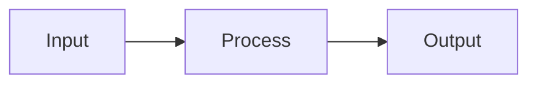
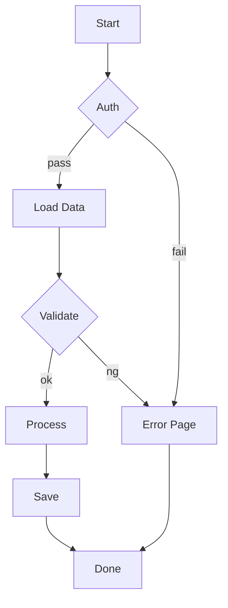
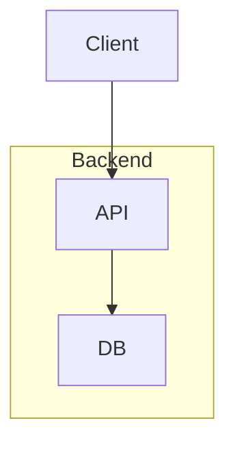
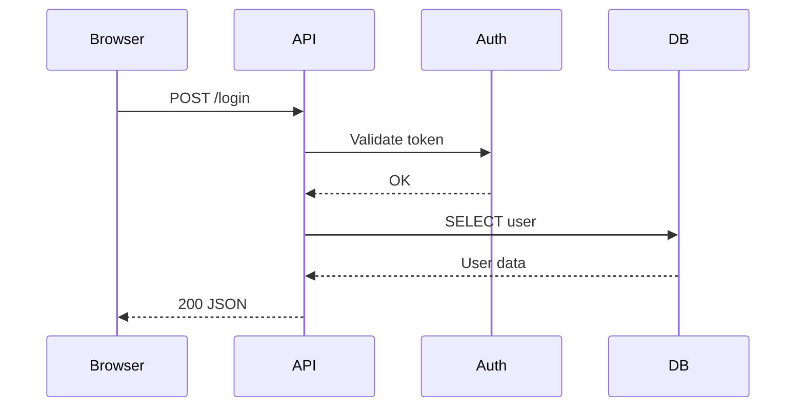

# moomaid

Mermaid diagram renderer written in MoonBit. Outputs ASCII art or SVG.

## Install

```bash
# Native binary (Linux x64, macOS arm64)
curl -fsSL https://raw.githubusercontent.com/mizchi/moomaid/main/install.sh | sh

# npm
npx moomaid -h

# MoonBit CLI tool
moon install mizchi/moomaid/cmd/moomaid

# MoonBit library
moon add mizchi/moomaid
```

## CLI

```bash
# Render from file
moomaid diagram.mmd
moomaid --svg diagram.mmd

# Render from stdin
echo 'graph LR; A --> B' | moomaid -

# HTML output
moomaid --html diagram.mmd

# HTML demo page (all diagram types)
moomaid --html
```

### Options

```
--svg          Output SVG (default: ASCII)
--ascii        Output ASCII art
--kitty        Output Kitty graphics protocol
--html         Output HTML with embedded SVG
--width <n>    Max width for ASCII (default: 80)
               For kitty: image width in px (default: 640)
-              Read from stdin
--help         Show help
```

## Portable Skill API

`cmd/skill` is the Wasm-friendly command package for `skills.mooncakes.io`.
It accepts Mermaid source from standard input and writes exactly one rendered
artifact on success.

```bash
# Local Wasm package
moon runwasm src/cmd/skill --format ascii < diagram.mmd
moon runwasm src/cmd/skill --format svg < diagram.mmd
moon runwasm src/cmd/skill --format svg --debug-layout < diagram.mmd

# Standalone script prototype with the same contract
moon run --target wasm examples/moomaid.mbtx --format ascii < diagram.mmd
```

`--format ascii|svg` controls the artifact and defaults to `ascii`. For SVG,
use `--theme`, `--font`, `--padding`, `--background`, `--transparent`,
`--title`, and `--description` to control presentation and accessibility.
`--debug-layout` adds flowchart diagnostics: node bounds are blue, edge-label
bounds are green, subgraph headings are purple, edge paths are orange, and
potential overlaps are highlighted in red.
On invalid Mermaid input, the command writes a `line` and `column` diagnostic
to standard error, leaves standard output empty, and exits with status `1`.
Invalid command-line arguments exit with status `2`.
After publishing, the same command is runnable by its Mooncakes coordinate:
`moon runwasm mizchi/moomaid/cmd/skill@<version> --format svg`.

## Diagramming guidance for agents

[`skills/moomaid-diagramming`](skills/moomaid-diagramming/SKILL.md) is an
agent skill for choosing a Mermaid diagram when explaining code or
architecture. It covers component boundaries, runtime requests, type and data
models, lifecycles, timelines, plans, and Git history, and includes rendering
and presentation checks.

## Diagram Types

### Flowchart (`graph LR` / `graph TD`)

Use for visualizing data flow, module dependencies, and process graphs.





`subgraph ... end` によるグループ化にも対応しています。



### Sequence Diagram (`sequenceDiagram`)

Use for describing layer boundaries and API call flows.



参加者の別名、`autonumber`、note、activation、`loop` / `alt` / `opt` /
`par` / `break` の制御ブロックを扱えます。拡張構文のASCII出力は、可搬性を
優先したイベントストリーム形式です。

### Other supported types

- `stateDiagram-v2` - State machine diagrams
- `classDiagram` - Class diagrams
- `erDiagram` - Entity relationship diagrams
- `timeline` - Chronological event outlines
- `gitGraph` - Branch, checkout, commit, and merge histories
- `gantt` - Sections and task start/duration tables
- `mindmap` - Indented architecture and idea outlines
- `journey` - Sections and user/system journey tasks
- `pie` - Labeled proportion outlines

## Library Usage

```moonbit
// ASCII output
let ascii = @moomaid.render_to_string("graph LR\n  A --> B")

// ASCII with options
let options : @moomaid.Options = {
  use_ascii: false,
  padding_x: 2,
  padding_y: 1,
  box_border_padding: 1,
  max_width: 80,
}
let ascii2 = @moomaid.render_to_string("graph LR\n  A --> B", options~)

// SVG output (experimental)
let svg = @moomaid.experimental_render_to_svg("graph LR\n  A --> B")

// Portable Skill API
let skill_svg = @moomaid.render(
  "graph LR\n  A --> B",
  @moomaid.OutputFormat::Svg,
)
```

## TUI Viewer

Interactive terminal viewer with tab switching and Kitty graphics protocol support.

```bash
just tui
```

- `Tab` / `Shift+Tab`: Switch diagrams
- `Up` / `Down`: Scroll
- `s`: Toggle ASCII / SVG mode (Kitty-compatible terminals)
- `q`: Quit

## License

Apache-2.0
