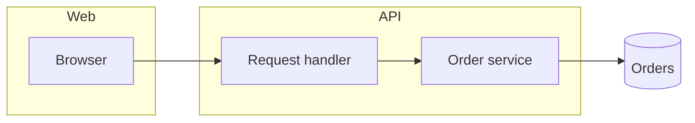
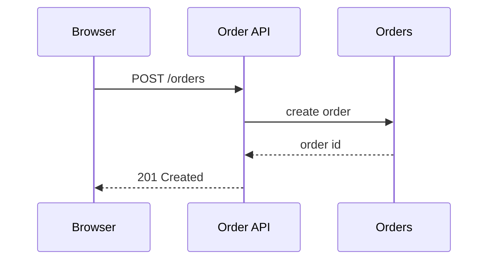
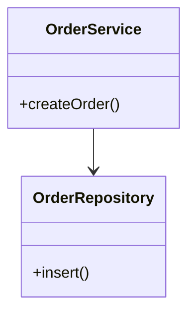

# Moomaid Diagramming

Explain one user question with one primary diagram. Start from the question,
not a preferred Mermaid syntax. Use a second diagram only when the first cannot
show both the static structure and the important behavior.

## Choose the diagram

| User needs to understand | Use | Show |
| --- | --- | --- |
| System, service, package, or module boundaries | `flowchart` with `subgraph` | Components, ownership, dependencies, and direction of data or control |
| One request, command, or event at runtime | `sequenceDiagram` | Participants, message order, branches, retries, and notable async boundaries |
| Public APIs, types, and code-level responsibilities | `classDiagram` | Types, important fields or operations, and relationships; omit implementation detail |
| Data ownership and cardinality | `erDiagram` | Entities, keys only when relevant, and one-to-one/one-to-many relationships |
| A domain object's legal lifecycle | `stateDiagram-v2` | States, triggers, guards, and terminal states |
| Architecture ideas, concerns, or a hierarchy before dependencies matter | `mindmap` | A root topic and progressively indented concepts |
| A user's experience across product or system stages | `journey` | Sections, tasks, scores, and actors; do not use it for request messages |
| A small, static composition of a whole | `pie` | Named shares and values; use a table instead when exact comparison matters |
| A small number of historical or product milestones | `timeline` | Dated milestones in chronological order |
| Planned work, dates, status, and duration | `gantt` | Tasks, schedule, and execution status; do not use for runtime behavior |
| Branching and commits | `gitGraph` | Branches, merges, and releases; do not use it as a project schedule |

Use a `flowchart` for a code control path when the ordering is simple and no
participant needs its own lifeline. Use a `sequenceDiagram` when the reader
must see who initiates each step or when concurrent/alternative paths matter.

For an architecture explanation that also needs a request walkthrough, render
two diagrams in this order:

1. A `flowchart` with `subgraph` for the system overview.
2. A `sequenceDiagram` for the representative request.

Do not combine deployment topology, entity cardinality, and runtime ordering in
one diagram. Split them into focused diagrams instead.

## Build an explanatory diagram

1. State the reader's question and scope in one sentence. Name what is
   intentionally outside the diagram when that boundary could be confusing.
2. Choose stable, short node IDs and labels in the user's language. Prefer
   responsibilities such as `Auth API` or `Persist order` over implementation
   trivia such as filenames or function-local variables.
3. Keep the primary view to roughly 5–12 visible nodes. Group related nodes in
   `subgraph` blocks before adding edges across boundaries.
4. Put edge labels on relationships that need a verb, protocol, data type, or
   cardinality. Leave obvious edges unlabeled. In an ASCII architecture view,
   keep cross-subgraph edges unlabeled and explain their verbs in the prose.
5. Use only facts available in the supplied code, design, or stated
   assumptions. Mark inferred relationships as assumptions in the prose.

Use these patterns as starting points.

### Component architecture

Use a left-to-right flowchart for dependencies. Make a subgraph match an owned
boundary: application, service, package, or infrastructure domain.



### Runtime request path

Use a sequence diagram after the overview when message ordering is the point.
Keep each message an observable operation; use `alt` or `par` only for real
branches or concurrency.



### Code or domain model

Use a class diagram for an API or type model, and an ER diagram when data
cardinality is the question. Do not use a class diagram merely because the
implementation language has classes.



## Render and inspect

Save each source as a `.mmd` file. Use ASCII as the primary output only for a
compact diagram with short labels. Use SVG as the primary output for a diagram
with multiple subgraphs, long labels, or several cross-boundary edges. Render
both when practical; never present an ASCII diagram whose labels cross borders
or other edges.

```bash
moon runwasm src/cmd/skill --format ascii < architecture.mmd
moon runwasm src/cmd/skill --format svg < architecture.mmd > architecture.svg
```

For an installed Mooncakes package, replace the local package path with
`mizchi/moomaid/cmd/skill@<version>`. The skill accepts only
`--format ascii|svg` and writes one rendered artifact to standard output.

Before presenting a diagram, check that labels are readable in the chosen
format, every edge has a clear direction, and the diagram answers the declared
question without requiring the reader to inspect source code first.

## Present the explanation

Lead with the conclusion, then show the diagram and three to five short points
that explain the highest-value relationships. Include the Mermaid source when
the user may want to edit it. State assumptions, omitted systems, and the next
diagram that would answer a different question rather than overloading the
current one.
